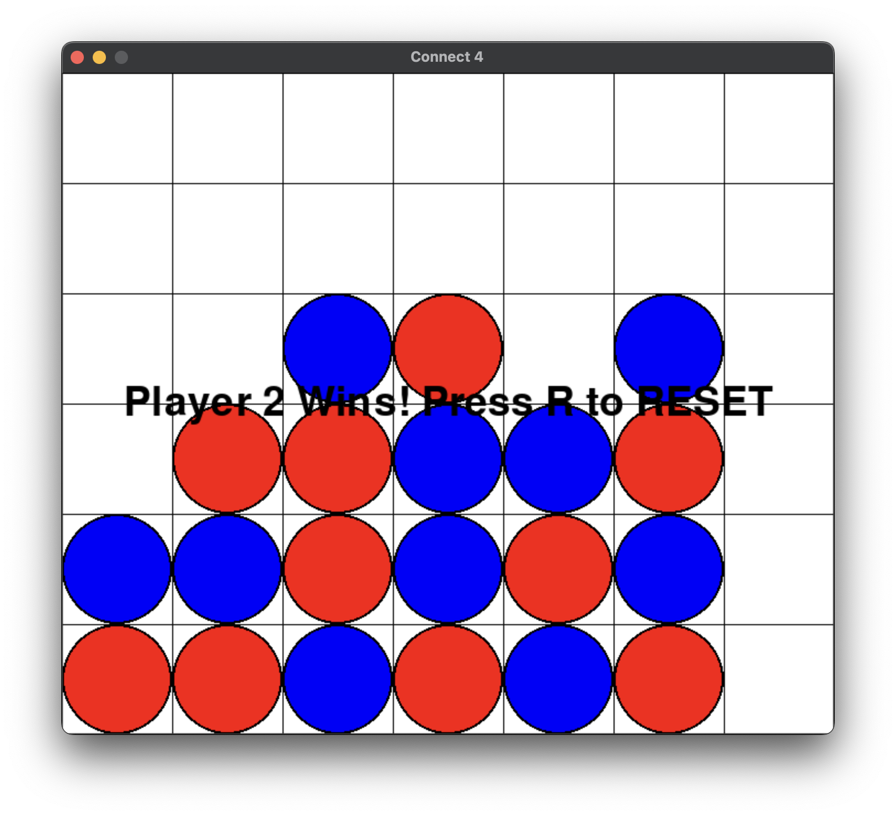

# Connect4
Simple Connect 4 Game using Pygame, OOP, and Modular Coding

Connect4Board.py demonstrates object-oriented programming by capturing key functionalities into a single, streamlined class, showcasing effective OOP design.
